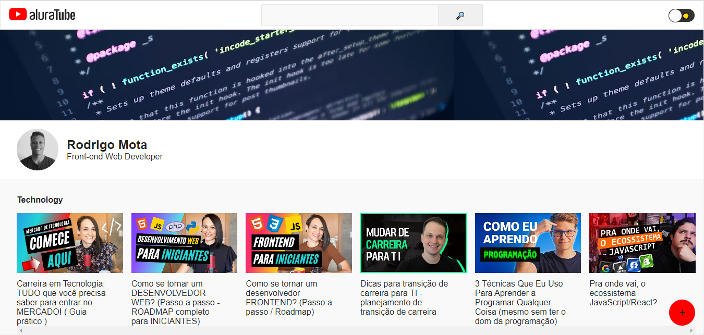

# AluraTube

  

This project was created during the Imersão React #5, an event developed by Alura.

## Tools and language used:

- [ReactJS](https://reactjs.org/)
- [NextJS](https://nextjs.org/)
- [Figma](https://www.figma.com/)
- [Node.js](https://nodejs.org/en/)
- [Styled-components](https://styled-components.com/)
- [Supabase](https://supabase.com/)
